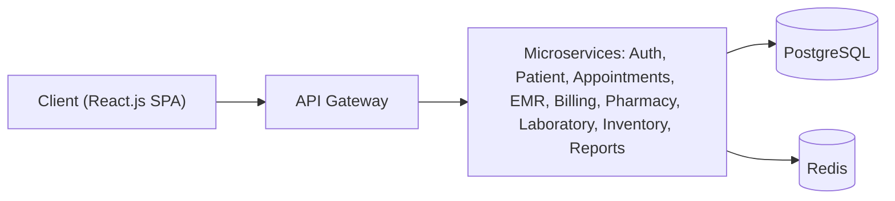

# Hospital Management System (HMS)

The Hospital Management System (HMS) is a modular, microservices-based platform that
streamlines hospital operations, improves patient care, automates clinical and administrative
workflows, and centralizes healthcare data management across departments. It provides a single
digital backbone for the people and processes that keep a hospital running — from patient
registration and appointments through medical records, billing, pharmacy, laboratory,
inventory, and analytics.

> **Project status:** Greenfield scaffold. This repository is being built out as a monorepo; the
> top-level structure documented below reflects where each concern lives as the system is
> implemented.

## Business Objectives

- **Reduce manual paperwork and administrative overhead** across departments.
- **Improve patient experience and operational efficiency** through automated, connected workflows.
- **Provide centralized digital healthcare records** accessible to authorized roles.
- **Enable real-time analytics and reporting** for clinical and operational decision-making.
- **Ensure regulatory compliance and data security** for sensitive patient information.

## Technology Stack

| Layer / Concern                  | Technology                                   |
| -------------------------------- | -------------------------------------------- |
| Frontend                         | React.js (single-page application)           |
| Backend                          | Node.js with Express (modular microservices) |
| Database                         | PostgreSQL                                   |
| Caching                          | Redis                                        |
| Cloud Platform                   | AWS                                          |
| Containerization & Orchestration | Docker & Kubernetes                          |
| CI/CD                            | GitHub Actions (Jenkins as an alternative)   |
| Monitoring                       | Prometheus & Grafana                         |
| Testing & Automation             | Playwright (UI), Postman/Newman (API)        |

## Architecture

HMS follows a **modular microservices architecture** for scalability and maintainability. Client
applications communicate through a single **API gateway** that routes requests to independently
deployable services (authentication, patient registration, appointments, medical records, billing,
pharmacy, laboratory, inventory, and reporting). Services persist data in **PostgreSQL** and use
**Redis** for caching and asynchronous coordination.



### Security

- **JWT-based authentication** with secure, role-based login.
- **Role-based authorization (RBAC)** scoped to each user role.
- **Multi-factor authentication (MFA)** for privileged users.
- **Encrypted patient data storage** to protect sensitive records at rest.
- **API gateway protection** as the single, guarded entry point to backend services.
- **Session timeout** and **audit logging** for accountability and compliance.

### Scalability

- **Horizontal scaling** of services via Kubernetes.
- **Database replication** for read scaling and availability.
- **Load balancing** across API instances.
- **Asynchronous job processing** for long-running and background work.

## User Roles

HMS supports eight user roles:

- Hospital Administrator
- Doctor
- Nurse
- Receptionist
- Lab Technician
- Pharmacist
- Patient
- Insurance Coordinator

## Core Modules

| Module                     | Description                                                                                           |
| -------------------------- | ----------------------------------------------------------------------------------------------------- |
| Patient Registration       | Create and update patient profiles, upload identification documents, and generate unique patient IDs. |
| Appointment Scheduling     | Manage doctor calendars, enable online appointment booking, and send SMS/email reminders.             |
| Electronic Medical Records | Maintain centralized digital healthcare records accessible across departments.                        |
| Billing & Insurance        | Generate invoices, manage insurance claims, and support multiple payment methods.                     |
| Pharmacy Management        | Track medicine inventory, manage prescriptions, and raise expiry alerts.                              |
| Laboratory Management      | Manage laboratory reports and diagnostic results.                                                     |
| Inventory Management       | Track hospital supplies and stock levels.                                                             |
| Reports & Analytics        | Provide real-time analytics and reporting across the hospital.                                        |

## Repository Structure

The project is organized as a monorepo. The top-level layout being scaffolded:

```
.
├── frontend/                         # React.js single-page application (all roles & modules)
├── backend/                          # Node.js/Express microservices + API gateway
├── database/                         # PostgreSQL schema, migrations, seeds, ERD
├── infrastructure/                   # Docker, Kubernetes, AWS IaC, monitoring (Prometheus/Grafana)
├── tests/                            # E2E test automation (Playwright UI, Postman/Newman API)
├── .github/                          # GitHub Actions CI/CD workflows
├── Hospital_Management_Documentation_Package/  # Source specification PDFs
├── docker-compose.yml                # Local dev orchestration (Postgres, Redis, services, frontend)
├── package.json                      # Monorepo workspace root & orchestration scripts
├── .env.example                      # Environment variable template
├── .gitignore
└── README.md
```

Purpose of each top-level entry:

| Entry                                        | Purpose                                                                                    |
| -------------------------------------------- | ------------------------------------------------------------------------------------------ |
| `frontend/`                                  | React.js single-page application serving all roles and modules.                            |
| `backend/`                                   | Node.js/Express microservices and the API gateway.                                         |
| `database/`                                  | PostgreSQL schema, migrations, seeds, and ERD artifacts.                                   |
| `infrastructure/`                            | Docker, Kubernetes, AWS infrastructure-as-code, and monitoring (Prometheus/Grafana).       |
| `tests/`                                     | End-to-end test automation (Playwright for UI, Postman/Newman for API).                    |
| `.github/`                                   | GitHub Actions CI/CD workflow definitions.                                                 |
| `Hospital_Management_Documentation_Package/` | Source specification PDFs (product, functional, architecture, database, QA).               |
| `docker-compose.yml`                         | Local development orchestration for PostgreSQL, Redis, backend services, and the frontend. |
| `package.json`                               | Monorepo workspace root and orchestration scripts.                                         |
| `.env.example`                               | Environment variable template to copy into a local `.env`.                                 |
| `.gitignore`                                 | Git ignore rules.                                                                          |
| `README.md`                                  | This document — the project's top-level entry point.                                       |

## Getting Started

### Prerequisites

- **Node.js** (LTS; the workspace requires Node `>=20.20.2` and npm `>=9`)
- **npm** (bundled with Node.js)
- **Docker** & **Docker Compose**
- _(Optional)_ **kubectl** for Kubernetes deployments

### Local Development

1. **Clone the repository:**

   ```bash
   git clone <repository-url>
   cd Hospital-Management
   ```

2. **Create your environment file** from the template and fill in real secrets:

   ```bash
   cp .env.example .env
   # then edit .env and set POSTGRES_PASSWORD, JWT_SECRET, DATA_ENCRYPTION_KEY, etc.
   ```

3. **Install root tooling** (linting, formatting, and workspace orchestration scripts):

   ```bash
   npm install
   ```

4. **Start the local stack** — PostgreSQL, Redis, backend services, and the frontend:

   ```bash
   docker compose up
   # or, using the workspace script (detached):
   npm run docker:up
   ```

5. **Run database migrations:**

   ```bash
   npm run db:migrate
   ```

6. **Access the application:**
   - Frontend dev server: `http://localhost:3000`
   - API gateway: `http://localhost:8080`

> Detailed, component-specific setup instructions live in the README of each subfolder —
> `frontend/`, `backend/`, `database/`, `infrastructure/`, and `tests/`.

## Testing & CI/CD

HMS is validated through a layered testing strategy:

- **Unit Testing** — individual functions and components.
- **Integration Testing** — interactions between services and data stores.
- **API Testing** — contract and behavior of service endpoints.
- **Security Testing** — authentication, authorization, and data-protection checks.
- **Performance Testing** — throughput and responsiveness under load.
- **User Acceptance Testing** — end-to-end validation against business requirements.

Automation and delivery:

- **UI automation** with **Playwright**.
- **API automation** with **Postman/Newman**.
- **Continuous integration** via **GitHub Actions** (with **Jenkins** as an alternative), covering
  automated build and deployment, Docker image creation, Kubernetes deployment, and monitoring
  through **Prometheus** and **Grafana**.

## Documentation

The authoritative product and engineering specifications live in
[`Hospital_Management_Documentation_Package/`](Hospital_Management_Documentation_Package/):

- `01_Hospital_Management_Product_Vision_and_Scope.pdf` — vision, business objectives, user roles, and core modules.
- `02_Hospital_Management_Functional_Requirements_Specification.pdf` — functional requirements.
- `03_Hospital_Management_Technical_Architecture.pdf` — technology stack and architecture.
- `04_Hospital_Management_Database_Design_and_ERD.pdf` — key entities, relationships, and the ERD.
- `05_Hospital_Management_QA_Testing_and_DevOps_Strategy.pdf` — QA, testing, and DevOps strategy.

## License

TBD — no `LICENSE` file is currently present in the repository (the project is marked private / `UNLICENSED`).
